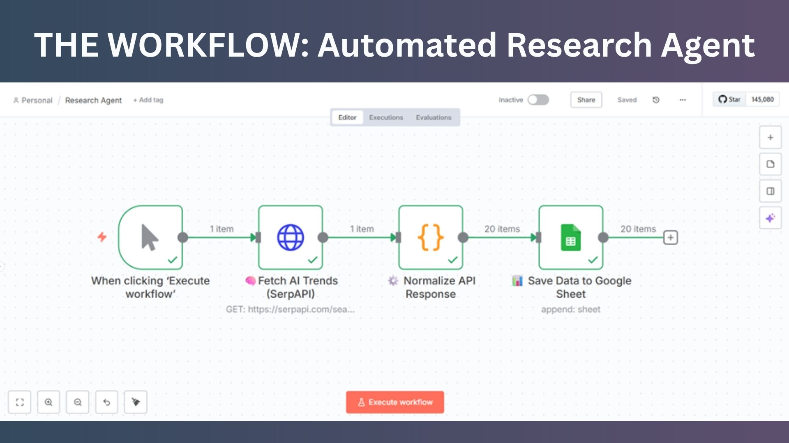
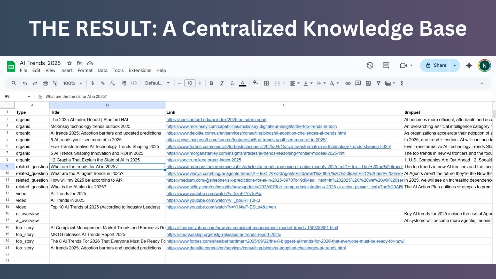
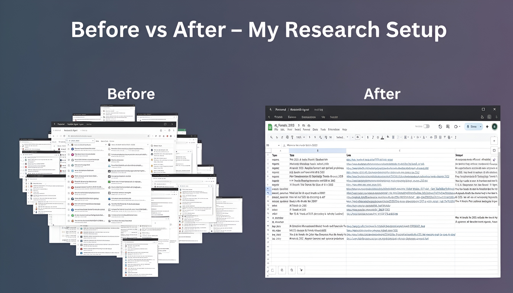

# Personal Research Agent

This project automates the process of gathering, organizing, and managing research insights using **n8n**, **SerpAPI**, and **Google Sheets**.

## Overview
The Personal Research Agent is designed to reduce information overload and streamline research. It automates data collection from search results, structures it, and stores it in a centralized spreadsheet for easy review and future analysis.

## Features
- **Automated Data Gathering**: Fetches top search results, snippets, and related insights via SerpAPI.
- **Data Normalization**: Cleans and structures raw API responses for consistency.
- **Centralized Storage**: Appends collected data into Google Sheets with organized columns.
- **(Upcoming)** AI Summarization using Hugging Face for concise summaries of collected insights.

## Workflow Summary
1. **🧠 Fetch AI Trends (SerpAPI)** – Retrieves top articles and insights for a given topic.  
2. **⚙️ Normalize API Response** – Formats the raw JSON data into a structured layout.  
3. **📊 Save Data to Google Sheet** – Stores all results in Google Sheets for reference.  
4. **🧾 Summarize with Hugging Face (Upcoming)** – Summarizes the collected insights.

## Tech Stack
- **n8n** – Workflow Automation Platform  
- **SerpAPI** – Real-time Search Engine Data API  
- **Google Sheets API** – Data Storage and Management  
- **Hugging Face Transformers (Upcoming)** – AI Text Summarization

## Screenshots
### Workflow Overview


### Data in Google Sheets


### Research Setup


## Setup Instructions
1. Clone this repository:
   ```bash
   git clone https://github.com/yourusername/personal-research-agent.git
   ```
2. Open the workflow in **n8n**.
3. Add credentials for:
   - SerpAPI
   - Google Sheets
4. Execute the workflow to automate data collection and storage.

## Future Improvements
- Add automatic summarization for all results.  
- Implement topic-based scheduling.  
- Integrate visualization of research trends.

